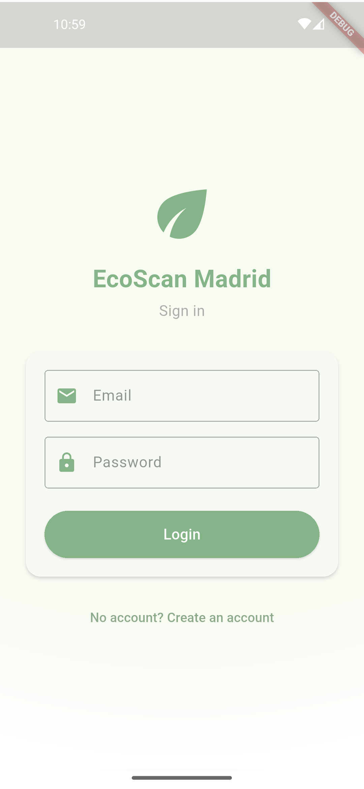
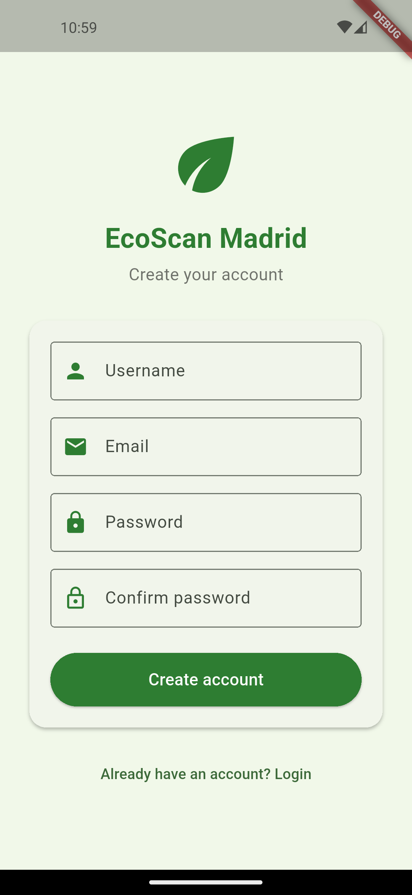
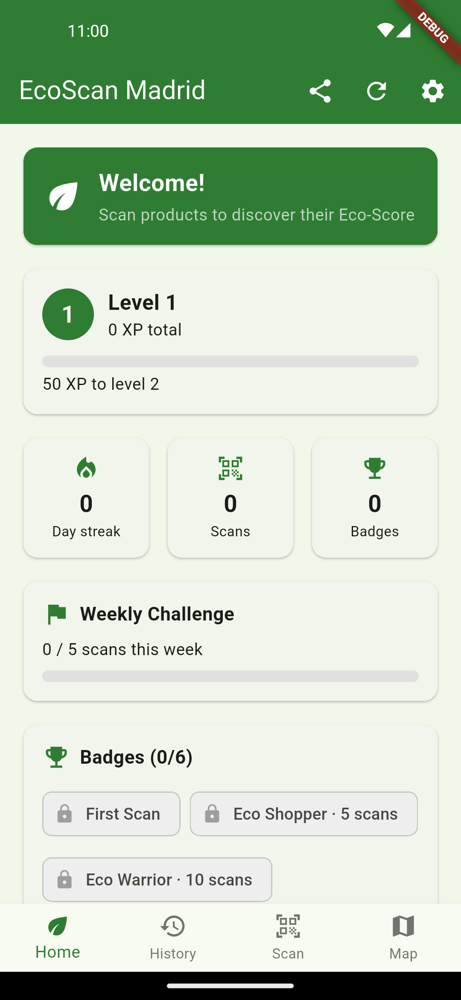
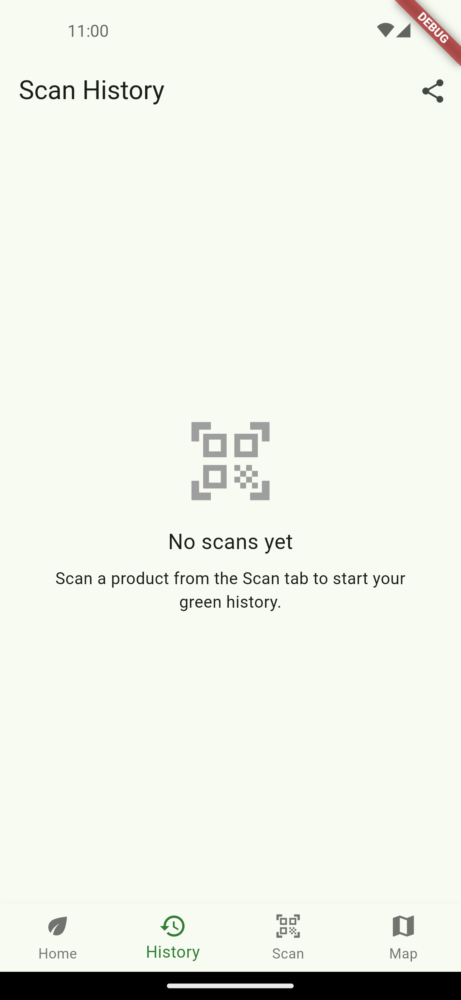
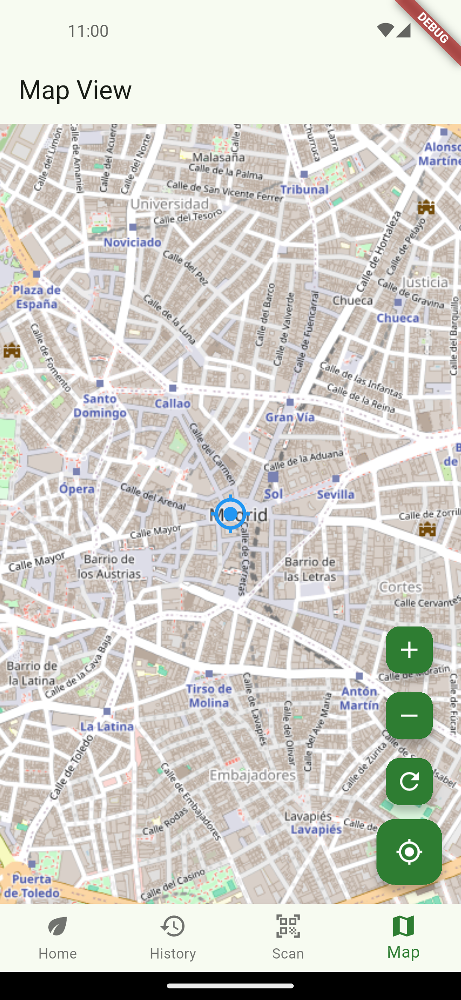
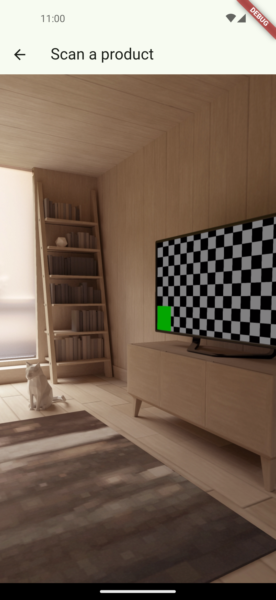
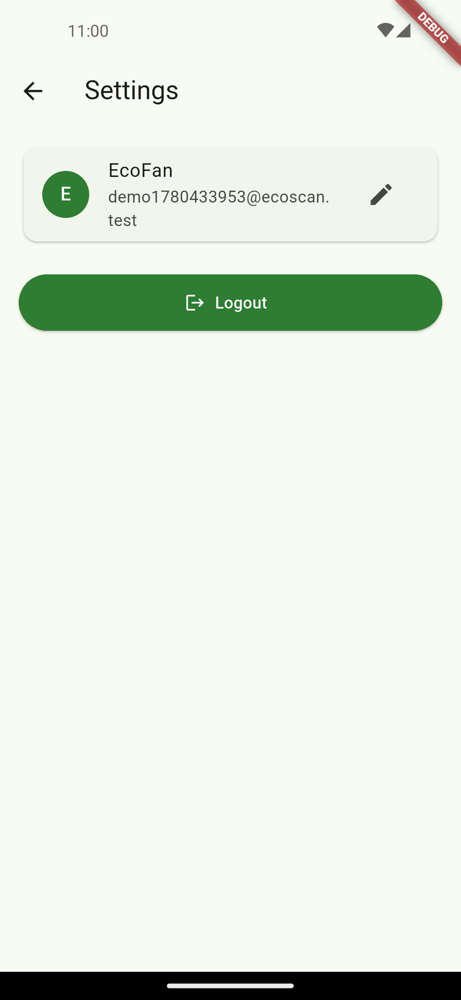

# EcoScan Madrid

A gamified Flutter app that turns grocery shopping into an eco-game: scan a product's barcode, get its Eco-Score, and earn XP, levels and badges for choosing greener products. Built as my Mobile App Development project at UPM.

## What is EcoScan Madrid?

Most of us have no idea about the environmental footprint of what we put in the basket. The data actually exists — [Open Food Facts](https://world.openfoodfacts.org/) has an Eco-Score (A–E) for hundreds of thousands of products — but nobody checks a website while shopping.

So I wrapped it in a game. You point your camera at a barcode, the app looks the product up on Open Food Facts and shows you its Eco-Score and Nutri-Score with colour-coded badges. Every scan earns XP (a sustainable A/B product earns a bonus), which feeds a level, a daily streak, a weekly challenge and a set of badges. Each scan is also pinned on a map of Madrid, coloured by Eco-Score, so over time you build a little "green map" of where you shop.

It's a student project, not a real sustainability tool — but it was a fun way to learn how to juggle the camera, an external REST API, GPS, Firebase and a live database while keeping the UI responsive.

## Screenshots and navigation

<table>
  <tr>
    <td>
      
      <p align="center">Login — Firebase email/password auth</p>
    </td>
    <td>
      
      <p align="center">Register — create an account with a username</p>
    </td>
  </tr>
  <tr>
    <td>
      
      <p align="center">Home — level, XP bar, stat tiles, weekly challenge & badges</p>
    </td>
    <td>
      
      <p align="center">History — live scan list (rename / delete / CSV export)</p>
    </td>
  </tr>
  <tr>
    <td>
      
      <p align="center">Map — scans coloured by Eco-Score, with zoom & "my location"</p>
    </td>
    <td>
      
      <p align="center">Scan — live barcode scanner (mobile_scanner)</p>
    </td>
  </tr>
  <tr>
    <td>
      
      <p align="center">Settings — change username, logout</p>
    </td>
    <td></td>
  </tr>
</table>

> Screenshots were captured automatically on an Android emulator with [Maestro](https://maestro.mobile.dev/) — the flow lives in [maestro/screenshots.yaml](maestro/screenshots.yaml). They show a fresh account (empty game state) before any product has been scanned.

## Features

### What the user can do
- Sign in with email/password, or create an account with a username — Firebase Authentication
- Scan a product barcode with the camera and instantly see its **Eco-Score** and **Nutri-Score** with colour-coded badges, plus a warning for a poor Eco-Score
- Earn **XP** (10 per scan, +15 for a sustainable A/B product), level up, keep a **daily streak**, chase a **weekly challenge** and unlock **badges** — all from a gamified home dashboard
- Browse a live **scan history**, rename or delete entries, and export them to CSV via the share sheet
- See every scan on a **map of Madrid**, coloured by Eco-Score, with zoom, refresh and a "my location" button
- Change the username or log out from a clean settings screen

### What's going on under the hood
- **Barcode scanning** with the camera — [scan_screen.dart](lib/screens/scan_screen.dart) (mobile_scanner)
- **Open Food Facts REST API** lookup over `http` (custom User-Agent, v2 `fields` query) — [off_service.dart](lib/services/off_service.dart)
- **Firebase Realtime Database** as the data layer — scans and badges live per-user under `users/{uid}/`, read live via `StreamBuilder` on `onValue`, written with `push().set` / `update` / `remove` — [realtime_db.dart](lib/services/realtime_db.dart)
- **Firebase Authentication** (email/password) with a `StreamBuilder` auth gate — [app.dart](lib/app.dart), [login_screen.dart](lib/screens/login_screen.dart)
- **Gamification engine** — pure-Dart XP / level / streak / weekly / badge logic, fully unit-tested — [game_stats.dart](lib/models/game_stats.dart)
- **OpenStreetMap** via `flutter_map` + `latlong2` — markers coloured by Eco-Score, polyline of your shopping route — [map_screen.dart](lib/screens/map_screen.dart)
- **Permission gate** requiring Camera + Location before play (`permission_handler`) — [permission_gate.dart](lib/screens/permission_gate.dart)
- **GPS** via `geolocator` (one-shot `getCurrentPosition`, 4-decimal coordinates) to tag and map each scan
- **CSV export** via `path_provider` + `share_plus`, dates via `intl`
- **Tests** — 27 unit tests covering the gamification math, the OFF JSON parser and the RTDB snapshot parser (`flutter test`)

## How to run it yourself

### 1. Prerequisites
- Flutter SDK (this project uses 3.41.x / Dart 3.11.x) — `flutter doctor` should be green
- An Android emulator/device or iOS simulator. **Camera scanning and the real Open Food Facts lookup need a physical device** (emulators have no real camera).

### 2. Install dependencies
```bash
flutter pub get
```

### 3. Set up Firebase (Auth + Realtime Database)
This app uses its own Firebase project (`ecoscan-madrid`); to run it under your own account:
- Create a project at https://console.firebase.google.com
- Enable **Authentication → Email/Password**
- Enable **Realtime Database** — **choose the `europe-west1` region** (the URL is wired in [lib/firebase_options.dart](lib/firebase_options.dart); pick another region only if you also change that `databaseURL`)
- Paste these per-user security rules in the **Rules** tab so each user only sees their own data:
  ```json
  {
    "rules": {
      "users": {
        "$uid": {
          ".read": "auth != null && auth.uid == $uid",
          ".write": "auth != null && auth.uid == $uid"
        }
      }
    }
  }
  ```
- Regenerate `firebase_options.dart` and drop `google-services.json` / `GoogleService-Info.plist` with the FlutterFire CLI:
  ```bash
  flutterfire configure
  ```
  > These service files are gitignored on purpose — they're per-project.

### 4. Open Food Facts
No key needed — the [public v2 API](https://world.openfoodfacts.org/) is used with a custom `User-Agent`. It's rate-limited (~15 reads/min/IP), which is plenty for scanning by hand.

### 5. Build and run
```bash
flutter run                 # pick a device
flutter run -d chrome       # fastest for the UI (no camera / no real scan)
flutter build apk --debug   # Android APK
```
> On Android, location is one-shot "when in use". Set the device/emulator GPS to **Madrid** (e.g. Puerta del Sol `40.4168, -3.7038`) so your scans land on the map in the right place.

## What I used (stack summary)

| Layer | Tech |
|-------|------|
| Language | Dart |
| UI | Flutter + Material 3 |
| State | `setState` + `FutureBuilder` / `StreamBuilder` |
| Auth | Firebase Authentication (email/password) |
| Data | Firebase Realtime Database (per-user, live) |
| Barcode | mobile_scanner |
| Product data | Open Food Facts REST API (`http`) |
| Maps | flutter_map (OpenStreetMap) + latlong2 |
| Location | geolocator + permission_handler |
| Misc | shared_preferences, share_plus, intl, logger, fluttertoast |
| Tests | flutter_test (27 unit tests) |
| Min SDK / iOS | Android 23 / iOS 13 (required by Firebase) |

## Authors

Two second-year students at UPM:

- **Chiriac Alex** (GitHub: [@ChiriacAlex](https://github.com/ChiriacAlex)) — alex.chiriac@alumnos.upm.es
- **Andrei-Costin Carp** (GitHub: [@krpandrei05](https://github.com/krpandrei05)) — andrei-costin.carp@alumnos.upm.es

## Honest notes

Things I'd do differently with more time:
- **Offline-first** — right now the app degrades to an empty state when the Realtime Database is unreachable; proper offline caching (or going back to a local DB mirror) would be nicer
- **Sync stats live across devices** — the home dashboard reads once on open + after a scan rather than streaming
- **Debounce duplicate scans more cleverly** — I pause the camera between scans, but a "last code seen" window would be cleaner
- **More tests on the Firebase layer** — the pure logic is well covered, but the RTDB read/write glue is only tested via the snapshot parser
- **Show the product photo** — the UI shows colour-coded score badges but not the Open Food Facts product image yet

Thanks for taking a look.
